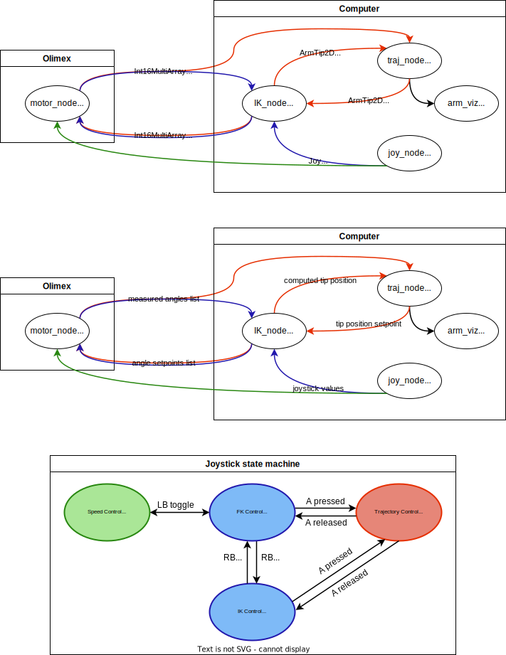

# hydraulic-robot-arm-ros

## Instructions

* Clone this respository on both the Olimex and your computer
* Connect both to the router
* Edit the .bashrc files
  * On your computer :
  ```
  export ROS_HOSTNAME=<computer_IP>
  export ROS_MASTER_URI=http://<computer_IP>:11311
  ```
  * On the Olimex :
  ```
  export ROS_MASTER_URI=http://1<computer_IP>:11311
  export ROS_IP=http://<computer_IP>
  export ROS_HOSTNAME=<olimex_IP>
  ```
* Plug a joystick to your computer
* Launch ROS nodes
  * On your computer:
  ```
  roslaunch arm_control pc_all.launch
  ```
  Additionaly you can run `rosrun arm_control arm.viz` to get a graphic representation of `/tip_xy_goal` .
  * On the Olimex :
  ```
  rosrun arm_control motor_node.py
  ```

## Graphs and operating modes


